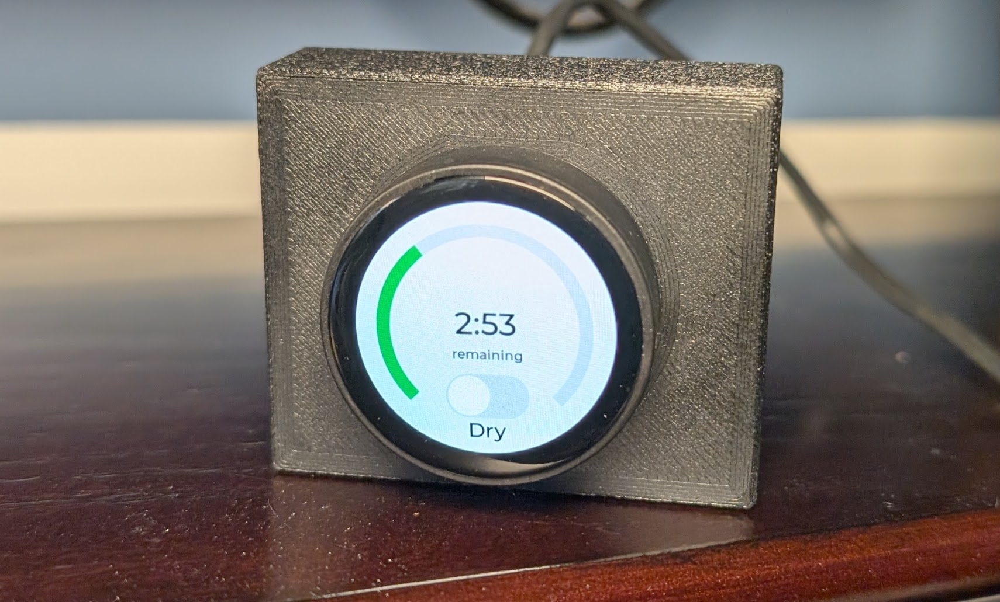

# ESP32_compressor_hmi

This is a simple HMI using an Elecrow T-Encoder Pro to control my esp32_compressor_controller and esp32_air_dryer_controller.  All external interactions are via MQTT over wifi.

## Manual configuration required
* You need to enter your real credentials for your wifi network and Adafruit.io account in `src/connection_settings.h`
* This project uses lvgl, and unfortunately lvgl requires configuration in `lv_conf.h` which it expects to find adjacent to wherever you've installed the `lvgl` library itself.  For instance, `.pio\libdeps\dfrobot_firebeetle2_esp32s3\lv_conf.h`.  My `lv_conf.h` is copied in the root of this project for reference, but you'll need to copy it to the appropriate location.